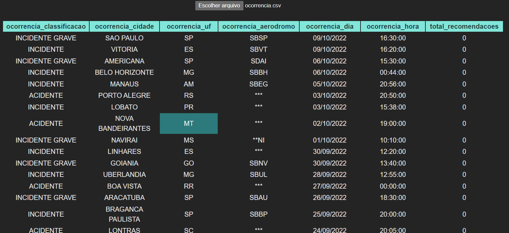

# <center>ExcelCSV-reader</center>

This simple app aims to read and reproduce a spreadsheet in .CSV format in a screen-friendly way.

How to use:

install the dependencies
```bash
npm install
or
yarn
```

run app
```bash
npm run dev
or
yarn dev
```

Upload a .csv file

sample output:
 

- The `ocorrencia.csv` file used to exemplify, was obtained from
  <a href='https://www2.fab.mil.br/cenipa'>Força Aérea Brasileira</a>

### Feature: 
  - in state: ``parsedData`` you can get the file in JSON format

## Open for PR:
- [ ] Cells cannot contain special characters
